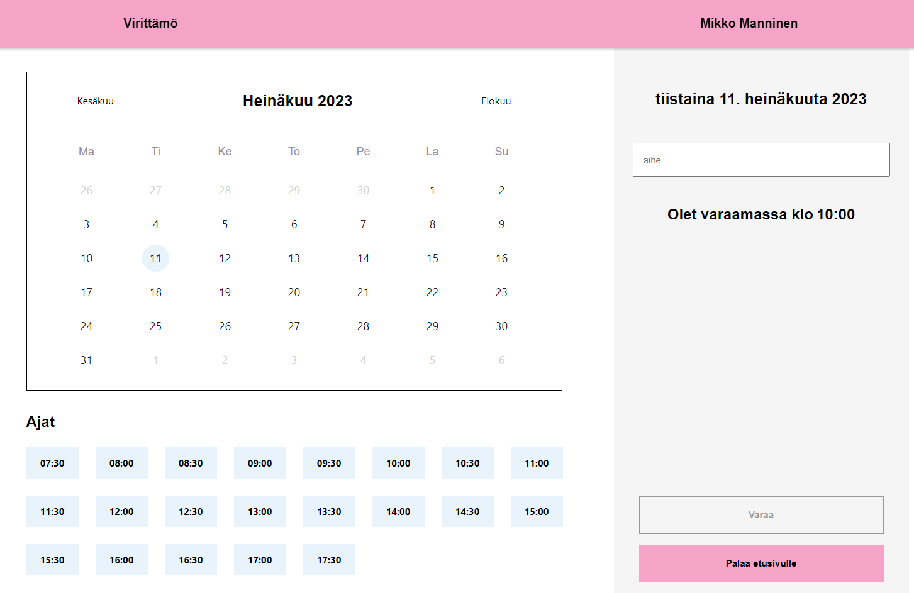
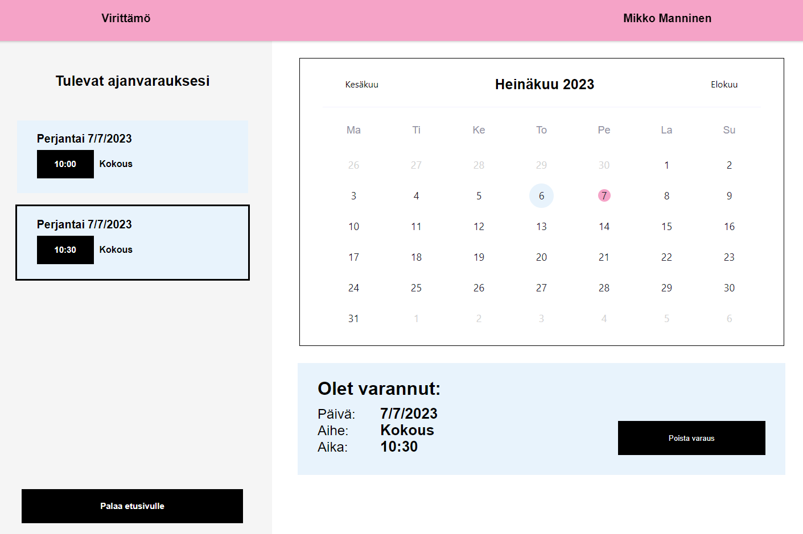

# kuutio-ajanvaraus
Kuutio is an application for booking a conference room located in Virittämö Helsinki. The front-end is made with React and the back-end uses Google Firebase services. 

The user can book a conference room by selecting the time of day and stating the subject of the booking.

The user can view the bookings made and delete them as needed. The admin user can view and delete all bookings.

# How to run the project

1. Clone the project from https://github.com/VirittamoHelsinki/kuutio-ajanvaraus.git
2. Run "npm install"
3. Start the project "npm run dev"
